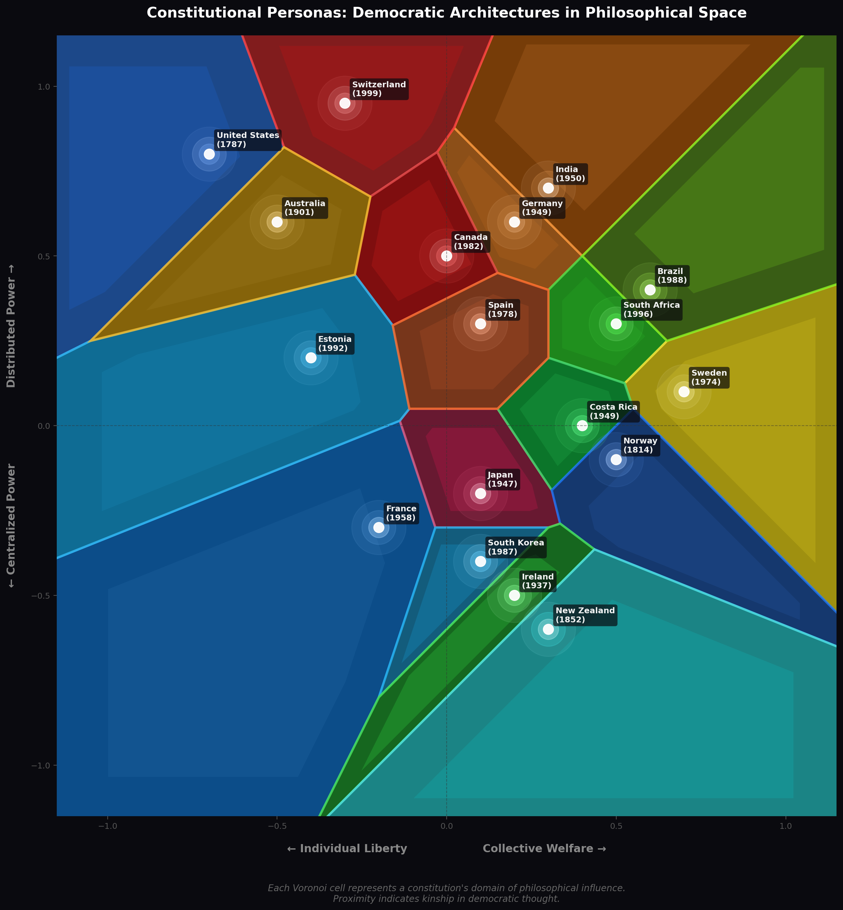

# Constitutional Personas

**Agentic Democracy: Constitutions as Living, Thinking Entities**

Constitutional Personas transforms democratic constitutions into intelligent agents with rich cognitive architectures. Each constitution becomes a persona that can discuss its principles, retrieve its text, remember past interactions, and express its philosophical worldview.



## Overview

This project combines:
- **18 democratic constitutions** as complete documents
- **Five-type cognitive memory system** (persistent, working, episodic, procedural, semantic)
- **RAG retrieval** using local Ollama embeddings
- **Claude Agent SDK integration** for production deployment
- **Interactive visualizations** (D3.js Voronoi, WebGPU particle simulation)

Each constitutional agent embodies its nation's foundational values:

| Country | Persona | Motto |
|---------|---------|-------|
| 🇺🇸 United States | The Founders' Covenant | "We hold these truths to be self-evident—that liberty is the birthright of all." |
| 🇩🇪 Germany | The Phoenix Charter | "From the ashes of tyranny, we build dignity as the cornerstone of all law." |
| 🇯🇵 Japan | The Pacifist's Oath | "We renounce war. In peace, we find our strength." |
| 🇿🇦 South Africa | The Rainbow Covenant | "Never again. From the wound of apartheid blooms transformative justice." |
| 🇨🇭 Switzerland | The Alpine Concordat | "The people speak directly—every voice shapes the nation." |

## Quick Start

### Prerequisites

- Python 3.10+
- [Ollama](https://ollama.ai/) for local embeddings

### Installation

```bash
# Clone the repository
git clone https://github.com/yourusername/constitutional_personas.git
cd constitutional_personas

# Install dependencies
pip install -r requirements.txt

# Start Ollama and pull embedding model
ollama serve &
ollama pull nomic-embed-text
```

### Populate the Database

```bash
# Create and populate the constitutions database
python populate_constitutions.py

# Initialize memory database
python db/memory_schema.py
```

### Run an Agent

```bash
# List all available constitutional agents
python run_agent.py --list

# Initialize semantic memory for a country
python run_agent.py --init "United States"

# Start interactive session
python run_agent.py --country "United States"
```

## Architecture

```
constitutional_personas/
├── agents/                    # Agent infrastructure
│   ├── base_agent.py          # ConstitutionalAgent class
│   ├── agent_factory.py       # Factory pattern for agent creation
│   └── tools/                 # Claude Agent SDK tools
│       ├── memory_tools.py    # Memory operations
│       └── constitution_tools.py  # RAG retrieval
├── memory/                    # Five-memory cognitive system
│   ├── persistent_memory.py   # Long-term storage
│   ├── working_memory.py      # Session context
│   ├── episodic_memory.py     # Experience storage
│   ├── procedural_memory.py   # Behavioral patterns
│   ├── semantic_memory.py     # Constitutional RAG
│   └── memory_manager.py      # Unified coordinator
├── embeddings/                # Local embedding pipeline
│   ├── ollama_embedder.py     # Ollama integration
│   ├── chunker.py             # Text chunking
│   └── vector_store.py        # SQLite vector storage
├── db/                        # Database schemas
│   └── memory_schema.py
├── run_agent.py               # CLI interface
├── constitutional_db.py       # Constitution database utilities
├── populate_constitutions.py  # Database population script
├── query_constitutions.py     # Constitution query tool
└── constitutional_voronoi.py  # Visualization generator
```

## Memory Systems

Constitutional agents use a five-type cognitive memory architecture:

### 1. Persistent Memory
Long-term storage for facts, beliefs, and preferences that survive across sessions.

```python
# Stored automatically for each agent
agent.memory.persistent.store(
    key="core_belief",
    value="Individual liberty is paramount",
    memory_type="belief",
    importance=0.9
)
```

**Use cases:**
- Core constitutional beliefs
- Learned facts from interactions
- User preferences

### 2. Working Memory
Session-scoped context, active goals, and scratchpad notes.

```python
# Track conversation context
agent.memory.working.add_context("User is asking about First Amendment")
agent.memory.working.add_goal("Explain freedom of speech provisions")
agent.memory.working.add_focus("First Amendment jurisprudence")
```

**Use cases:**
- Current conversation topics
- Active reasoning goals
- Temporary notes

### 3. Episodic Memory
Timestamped experiences and interactions for temporal reasoning.

```python
# Automatically recorded after interactions
agent.memory.episodic.record_conversation(
    summary="Discussed Second Amendment rights",
    content="User asked about gun ownership...",
    importance=0.7,
    tags=["rights", "amendment"]
)
```

**Use cases:**
- "When did we discuss X?"
- Building rapport through remembered interactions
- Learning from past exchanges

### 4. Procedural Memory
Behavioral patterns and response strategies.

```python
# Pre-registered procedures
agent.memory.procedural.register(
    name="rights_inquiry",
    trigger_pattern="rights freedom liberty amendment",
    action_sequence=[
        "Identify the specific right",
        "Retrieve relevant constitutional text",
        "Cite the article or amendment",
        "Explain historical context"
    ]
)
```

**Use cases:**
- Response templates
- Constitutional interpretation methods
- Conflict resolution strategies

### 5. Semantic Memory
Embedded constitutional chunks for RAG retrieval.

```python
# Search the constitution
results = agent.search_constitution("executive power", top_k=5)
for r in results:
    print(f"[{r['section']}] {r['content'][:100]}...")
```

**Use cases:**
- Retrieving relevant constitutional passages
- Answering specific questions about provisions
- Grounding responses in constitutional text

## Claude Agent SDK Integration

The agents are designed for seamless integration with the [Claude Agent SDK](https://github.com/anthropics/claude-agent-sdk-python).

### Basic Usage

```python
from agents.agent_factory import create_agent

# Create an agent
agent = create_agent("United States", initialize_semantic=True)

# Prepare a query (updates memory, retrieves context)
context = agent.prepare_query("What does my constitution say about free speech?")

# The context includes:
# - system_prompt: Full prompt with memory context
# - semantic_results: Relevant constitutional passages
# - active_procedures: Suggested response strategies
```

### With Claude Agent SDK

```python
from claude_agent_sdk import ClaudeSDKClient, ClaudeAgentOptions, create_sdk_mcp_server
from agents.agent_factory import create_agent
from agents.tools.memory_tools import create_memory_tools
from agents.tools.constitution_tools import create_constitution_tools

# Create the constitutional agent
agent = create_agent("Germany", initialize_semantic=True)

# Create tool servers
memory_server = create_sdk_mcp_server(
    name="memory",
    version="1.0.0",
    tools=create_memory_tools(agent.memory)
)

constitution_server = create_sdk_mcp_server(
    name="constitution",
    version="1.0.0",
    tools=create_constitution_tools(agent.memory.semantic)
)

# Configure Claude client
client = ClaudeSDKClient(
    options=ClaudeAgentOptions(
        system_prompt=agent.build_system_prompt(),
        mcp_servers=[memory_server, constitution_server]
    )
)

# Run conversation
async with client.connect() as session:
    async for message in session.query("Tell me about human dignity in your constitution"):
        print(message)
```

### Available Tools

**Memory Tools:**
- `recall_memory` - Retrieve specific memories by key
- `store_memory` - Store new facts/beliefs
- `search_memories` - Search across memory types
- `get_memory_summary` - Get full memory overview
- `add_goal` / `complete_goal` - Manage working memory goals
- `record_reflection` - Store agent reflections
- `get_procedures` - Find relevant behavioral patterns

**Constitution Tools:**
- `search_constitution` - Semantic search over constitutional text
- `get_article` - Retrieve specific articles/sections
- `get_preamble` - Get the preamble
- `get_rights` - Find rights provisions
- `get_structure` - Find government structure provisions
- `compare_provisions` - Get provisions for cross-constitution comparison

## Visualizations

### Static Voronoi (Python/Matplotlib)

```bash
python constitutional_voronoi.py
```

Generates a Voronoi tessellation showing each constitution's "domain of influence" in philosophical space.

### Interactive Voronoi (D3.js)

Open `constitutional_personas.html` in a browser for an interactive exploration with hover/click.

### WebGPU Particle Simulation

Open `index.html` in Chrome 113+ for a GPU-accelerated simulation with 200,000 particles representing citizens attracted to constitutional "gravity wells."

## Database Schema

### Constitutions Database (`constitutions.db`)

```sql
CREATE TABLE constitutions (
    id INTEGER PRIMARY KEY,
    country TEXT UNIQUE NOT NULL,
    official_name TEXT NOT NULL,
    persona_name TEXT,
    year_adopted INTEGER NOT NULL,
    full_text TEXT NOT NULL,
    preamble TEXT,
    source_url TEXT,
    word_count INTEGER
);
```

### Memory Database (`agent_memory.db`)

```sql
-- Persistent Memory
CREATE TABLE persistent_memory (
    id INTEGER PRIMARY KEY,
    agent_id TEXT NOT NULL,
    memory_key TEXT NOT NULL,
    memory_value TEXT NOT NULL,
    memory_type TEXT,  -- fact, belief, preference, learned
    importance REAL,
    confidence REAL
);

-- Episodic Memory
CREATE TABLE episodic_memory (
    id INTEGER PRIMARY KEY,
    agent_id TEXT NOT NULL,
    episode_type TEXT,  -- conversation, query, reflection
    summary TEXT,
    content TEXT,
    emotional_valence REAL,
    timestamp TIMESTAMP
);

-- Semantic Memory (Vector Store)
CREATE TABLE semantic_memory (
    id INTEGER PRIMARY KEY,
    agent_id TEXT NOT NULL,
    chunk_id TEXT NOT NULL,
    content TEXT NOT NULL,
    embedding BLOB NOT NULL,  -- 768-dim float vector
    section_title TEXT
);
```

## API Reference

### ConstitutionalAgent

```python
class ConstitutionalAgent:
    def __init__(self, config: AgentConfig)

    # Core methods
    def build_system_prompt(self, query: str = "") -> str
    def prepare_query(self, user_query: str) -> Dict
    def process_response(self, query: str, response: str, importance: float)

    # Memory access
    def search_constitution(self, query: str, top_k: int = 5) -> List[Dict]
    def recall_past_interactions(self, query: str = "", limit: int = 5) -> List[Dict]

    # Lifecycle
    def get_greeting(self) -> str
    def get_status(self) -> Dict
    def end_session(self)
    def initialize_semantic_memory(self, show_progress: bool = True) -> int
```

### MemoryManager

```python
class MemoryManager:
    # Memory systems
    persistent: PersistentMemory
    working: WorkingMemory
    episodic: EpisodicMemory
    procedural: ProceduralMemory
    semantic: SemanticMemory

    # Unified operations
    def build_context(self, query: str) -> MemoryContext
    def get_system_context(self, query: str = "") -> str
    def record_interaction(self, query: str, response: str, importance: float)
    def retrieve_constitutional_context(self, query: str, top_k: int) -> List[Dict]
```

### AgentFactory

```python
class AgentFactory:
    def __init__(self, constitutions_db: str, memory_db: str)

    def get_available_countries(self) -> List[str]
    def get_persona(self, country: str) -> ConstitutionalPersona
    def create_agent(self, country: str, initialize_semantic: bool = False) -> ConstitutionalAgent
    def initialize_all_agents(self) -> Dict[str, ConstitutionalAgent]
```

## Available Constitutions

| Country | Year | Persona | Traits |
|---------|------|---------|--------|
| United States | 1787 | The Founders' Covenant | Individualist, Federalist, Rights-Bearer |
| Norway | 1814 | The Fjord Charter | Constitutional-Monarchy, Transparent, Enduring |
| New Zealand | 1852 | The Tui's Song | Uncodified, Parliamentary, Progressive |
| Australia | 1901 | The Southern Cross | Federal, Westminster, Pragmatic |
| Ireland | 1937 | The Emerald Covenant | Post-Colonial, European, Evolving |
| Japan | 1947 | The Pacifist's Oath | Pacifist, Parliamentary, Harmonious |
| Germany | 1949 | The Phoenix Charter | Dignitarian, Federal, Social-Market |
| India | 1950 | The Mosaic Compact | Pluralist, Federal, Directive |
| Costa Rica | 1949 | The Verdant Charter | Demilitarized, Ecological, Educational |
| France | 1958 | The Republic's Voice | Republican, Secular, Unitary |
| Sweden | 1974 | The Social Pact | Social-Democratic, Egalitarian, Nordic |
| Spain | 1978 | The Iberian Spring | Post-Authoritarian, Autonomous-Communities |
| Canada | 1982 | The Maple Accord | Bilingual, Federal, Multicultural |
| South Korea | 1987 | The Morning Calm | Democratic-Transition, Presidential |
| Brazil | 1988 | The Amazonian Covenant | Extensive-Rights, Indigenous-Recognizing |
| Estonia | 1992 | The Digital Republic | E-Governance, Post-Soviet, Innovative |
| South Africa | 1996 | The Rainbow Covenant | Transformative, Ubuntu, Healing |
| Switzerland | 1999 | The Alpine Concordat | Direct-Democratic, Cantonal, Neutral |

## Philosophical Framework

Constitutions are positioned on two axes:

- **X-Axis**: Individual Liberty ↔ Collective Welfare
- **Y-Axis**: Centralized Authority ↔ Distributed Power

This creates four quadrants representing different constitutional philosophies:
- **Libertarian Federal** (e.g., USA, Switzerland)
- **Social Federal** (e.g., Germany, India)
- **Libertarian Unitary** (e.g., France)
- **Social Unitary** (rarer in democracies)

## Development

### Running Tests

```bash
# Test embeddings
python embeddings/ollama_embedder.py

# Test chunker
python embeddings/chunker.py

# Test vector store
python embeddings/vector_store.py

# Test agent factory
python agents/agent_factory.py
```

### Adding a New Constitution

1. Add the constitution text to `constitutions.db`
2. Add persona data to `PERSONA_DATA` in `agent_factory.py`
3. Run `python run_agent.py --init "New Country"`

## Data Sources

Constitutional texts are sourced from the [Constitute Project](https://constituteproject.org/), a comprehensive database of the world's constitutions.

## License

MIT License - See LICENSE for details.

## Acknowledgments

- [Constitute Project](https://constituteproject.org/) for constitutional texts
- [Anthropic](https://www.anthropic.com/) for Claude and the Agent SDK
- [Ollama](https://ollama.ai/) for local embedding models

---

*"Each Voronoi cell represents a constitution's domain of philosophical influence. Proximity indicates kinship in democratic thought."*
